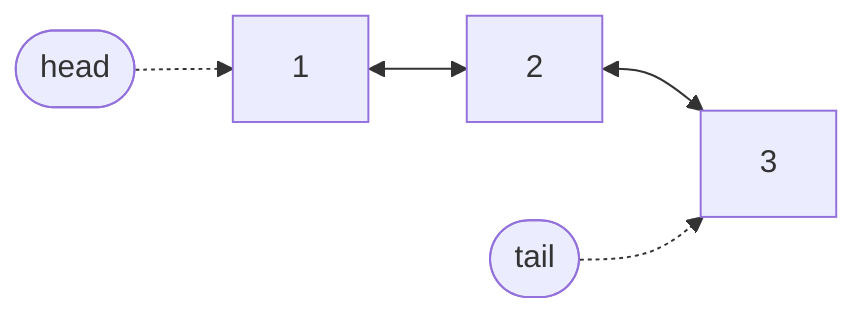

# Doubly Linked List

A doubly linked list is a [singly linked list](singly-linked-list.md) whose
nodes link both ways. Each node holds one element, a link to the node after
it and a link to the node before it. That second link is the whole
difference, and this page is about what it buys and what it costs.

The guide's implementation is
[`DoublyLinkedList`][cs_survival_kit.data_structures.doubly_linked_list.DoublyLinkedList].
Like `SinglyLinkedList` and `DynamicArray`, it implements
[`AbstractList`][cs_survival_kit.data_structures.abstract_list.AbstractList],
so the three can be compared operation for operation.

## How it works

As in the singly linked list, the list keeps a **head** reference, a
**tail** reference and a **size count**. The head's backward link and the
tail's forward link are empty; every other link has a node at both ends.

"Doubly" linked means that from any node you can reach everything after it
*and* everything before it. The singly linked list's one restriction, that a
node knows nothing about its predecessor, is gone, and so are the operations
it made expensive.

## Working at the end

The singly linked list has no cheap way to remove its last element: unlinking
the tail means updating the node before it, and finding that node means
walking from the head. Here the tail's backward link *is* that node. Removing
from the end moves the tail one step back and clears the old tail's links,
which is O(1).

That makes this the structure that is O(1) at **both** ends. Adding and
removing at the front work exactly as they do in the singly linked list, and
adding at the end uses the tail reference as before.

| Operation | In the library |
| --- | --- |
| Add at the front | [`prepend`][cs_survival_kit.data_structures.doubly_linked_list.DoublyLinkedList.prepend] |
| Remove from the front | [`pop_front`][cs_survival_kit.data_structures.doubly_linked_list.DoublyLinkedList.pop_front] |
| Add at the end | [`append`][cs_survival_kit.data_structures.doubly_linked_list.DoublyLinkedList.append] |
| Remove from the end | [`pop_back`][cs_survival_kit.data_structures.doubly_linked_list.DoublyLinkedList.pop_back] |

A queue needs the first two, a stack needs the last two, and a
double-ended queue needs all four. Python's `collections.deque` is built on
this idea.

## Walking from the nearer end

Reaching element `i` still means following links, but now there is a choice
of where to start. If `i` is in the first half of the list the walk starts
at the head and follows `i` forward links; otherwise it starts at the tail
and follows `n - 1 - i` backward links. The walk is never longer than half
the list, and a position near either end is a few steps away no matter how
long the list is.

This halves the average walk without changing its shape. Reading position
`i` is O(min(i, n − 1 − i)), which is still O(n) in the middle, so reading by
position is not where a doubly linked list beats an array. What it does win
is the last few positions: `a[n - 1]` is O(1) here and O(n) in a singly
linked list.

[`insert`][cs_survival_kit.data_structures.doubly_linked_list.DoublyLinkedList.insert]
and
[`pop`][cs_survival_kit.data_structures.doubly_linked_list.DoublyLinkedList.pop]
at a position use the same walk to find the node, and then the backward link
pays off a second time. Unlinking a node means pointing its two neighbours at
each other, and both neighbours are one link away. The singly linked list had
to carry a reference to the previous node as it walked, because nothing else
could lead back to it.

## Walking backward

`reversed(a)` follows the backward links from the tail, visiting every
element in O(n) time with no extra memory. A singly linked list cannot do
this, since its nodes only point forward. The library gives
[`AbstractList`][cs_survival_kit.data_structures.abstract_list.AbstractList]
a default `reversed` that iterates forward once into a buffer and yields the
buffer backward, which keeps the singly linked list linear at the cost of
O(n) extra space. The doubly linked list overrides it and pays neither.

## Reversing

[`reverse`][cs_survival_kit.data_structures.doubly_linked_list.DoublyLinkedList.reverse]
is simpler here than in the singly linked list. Walk the list once and swap
each node's two links. Once a node's links are swapped, its old forward link
is in the backward slot, so the walk continues through the backward link.
When every node is done, swap the head and tail references. No nodes are
created, so it is O(n) time and O(1) extra space.

## What the extra link costs

Nothing comes for free. Every node carries a third reference, so a doubly
linked list uses more memory per element than a singly linked one, and
adding or removing a node updates up to four links instead of two. Those are
constant-factor costs: they show up as a higher line on a chart, not a
steeper one. And nothing in the middle of the list gets cheaper. Reading,
inserting or removing at a position still means walking there.

## Doubly or singly?

| | Doubly linked list | Singly linked list |
| --- | --- | --- |
| Add or remove at the front | O(1) | O(1) |
| Add at the end | O(1) | O(1) |
| Remove from the end | O(1) | O(n) |
| Read by position | O(n), from the nearer end | O(n), from the head |
| Walk backward | O(n), O(1) extra space | O(n), O(n) extra space |
| Memory per element | a node and two links | a node and one link |

Reach for the doubly linked list when the work is at both ends, or when a
node has to be unlinked given only the node itself. That second case is why
an LRU cache is the classic pairing of a hash map with a doubly linked list:
the map finds the node, and the backward link lets it be removed from the
middle in O(1). The singly linked list is enough when the work is at the
front, and it is the smaller of the two.

## Measured

The benchmarks below time the library's `DoublyLinkedList` against its
`SinglyLinkedList` and `DynamicArray`, Python's built-in `list` (a dynamic
array written in C), and `collections.deque` (a doubly linked list of
blocks, also in C). All chart axes are logarithmic.

### Removing from the end

Each run empties a container of n elements from the back. The first tab
divides by n to give the cost of one removal.

{{ benchmark("doubly_linked_list.pop_back") }}

The doubly linked list, the deque and the built-in list are flat: a removal
costs the same whatever the size. The singly linked list climbs in step with
n, because every removal walks the whole list to find the new tail. On the
total-time tab that is a line of slope 2 against three of slope 1, and it is
why the singly linked list is measured at far smaller sizes than the others.

The two C structures sit well below the doubly linked list. That gap is the
cost of a Python-level node and its links; it does not grow with n.

### Reading near the end

Here n is the size of the container, and every run performs the same 100
reads at the last 100 positions. The time is not divided by n: a flat line
means a read costs the same in a container of any size.

{{ benchmark("doubly_linked_list.index_near_tail") }}

The doubly linked list is flat, because each read starts from the tail and
is at most a hundred steps away. The singly linked list rises in step with n,
because its reads start at the head. Both arrays are flat and far cheaper,
since neither walks at all.

### Reading by position

The same 100 reads, now spread evenly across the container.

{{ benchmark("doubly_linked_list.index") }}

Now both linked lists rise together. Starting from the nearer end halves the
walk, so the doubly linked list sits below the singly linked list by a
constant factor, but the two lines have the same slope. Both arrays stay
flat. This is the chart to remember before choosing a linked list for data
that will be read by position.

## Complexity

| Operation | Time | Notes |
| --- | --- | --- |
| Add or remove at either end | O(1) | |
| Read by position | O(n) | walks from the nearer end |
| Insert or remove by position | O(n) | the walk is the cost; relinking is O(1) |
| Search for a value | O(n) | |
| Remove a value | O(n) | finding it is the cost; unlinking is O(1) |
| Reverse | O(n) | in place, O(1) extra space |
| Walk backward | O(n) | follows the backward links, O(1) extra space |
| Length | O(1) | from the stored count |
| Iterate | O(n) | |
