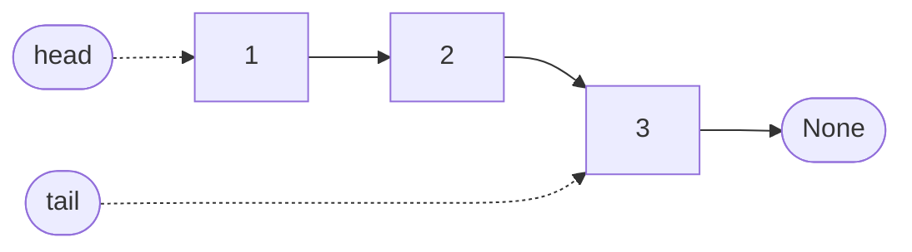

# Singly Linked List

A linked list stores a sequence as a chain of **nodes**. Each node holds one
element and a link to the node after it. Nothing is stored side by side: the
nodes can sit anywhere in memory, and the links are what put them in order.

That is the opposite of a [dynamic array](dynamic-array.md), which keeps its
elements in one contiguous block. The two are the classic implementations of
the same idea, a list, and almost every difference between them follows from
that one choice of layout.

The guide's implementation is
[`SinglyLinkedList`][cs_survival_kit.data_structures.singly_linked_list.SinglyLinkedList].
Like `DynamicArray`, it implements
[`AbstractList`][cs_survival_kit.data_structures.abstract_list.AbstractList],
the interface the two share.

## How it works

The list itself keeps three things:

- **`head`**, a reference to the first node. Every walk through the list
  starts here.
- **`tail`**, a reference to the last node, so that adding at the end does
  not require walking the whole chain to find it.
- **a size count**, so that `len` does not require walking the chain either.

"Singly" linked means each node links only **forward**. Given a node you can
reach everything after it and nothing before it. That one restriction decides
which operations are cheap.

## Working at the front

Adding at the front creates a node, points it at the current head, and makes
it the new head. Removing from the front moves the head to the second node.
Neither touches any other node, so both are O(1) no matter how long the list
is.

An array cannot do this. Its first element lives in slot 0, so putting
something in front of it means shifting every element one slot to the right,
and removing it means shifting them all back. Both are O(n).

| Operation | In the library |
| --- | --- |
| Add at the front | [`prepend`][cs_survival_kit.data_structures.singly_linked_list.SinglyLinkedList.prepend] |
| Remove from the front | [`pop_front`][cs_survival_kit.data_structures.singly_linked_list.SinglyLinkedList.pop_front] |

## Working at the end

With a tail reference,
[`append`][cs_survival_kit.data_structures.singly_linked_list.SinglyLinkedList.append]
is O(1) too: link the new node after the tail, then move the tail to it.

Removing from the end is a different story. To unlink the last node you have
to update the node *before* it, and there is no link pointing backward to
find that node. The only way to reach it is to walk from the head, which is
O(n). A singly linked list therefore has no cheap way to remove its last
element. A doubly linked list, where each node also links backward, exists to
fix exactly this.

## Finding an element

An array can compute where element `i` lives: its elements are evenly spaced
in one block, so the position is a multiplication away. A linked list cannot.
A node's location says nothing about where the next one is, so the only way
to reach element `i` is to start at the head and follow `i` links.

Reading by position, searching for a value, and removing a value all need
that walk, so all three are O(n).

[`remove`][cs_survival_kit.data_structures.singly_linked_list.SinglyLinkedList.remove]
has one extra wrinkle. Unlinking a node means pointing the previous node past
it, so the walk has to carry a reference to the previous node as it goes.

## Reversing

[`reverse`][cs_survival_kit.data_structures.singly_linked_list.SinglyLinkedList.reverse]
is the classic linked list exercise. It walks the list once and turns each
link around to point at the node before it. Because overwriting a link loses
the way forward, the walk keeps three references: the previous node, the
current node, and the next node, saved just before its link is changed. At
the end the old tail is the new head. No nodes are created, so it takes O(n)
time and O(1) extra space.

## Linked list or dynamic array?

| | Singly linked list | Dynamic array |
| --- | --- | --- |
| Add at the front | O(1) | O(n) |
| Remove from the front | O(1) | O(n) |
| Add at the end | O(1) | O(1) amortized |
| Remove from the end | O(n) | O(1) |
| Read by position | O(n) | O(1) |
| Search for a value | O(n) | O(n) |
| Memory | a node and a link per element | one block, with some unused slots |

Neither is better. A linked list wins when the work is at the front of the
sequence, which is why queues are often built on one. An array wins whenever
elements are read by position, and that is most of the time, which is why
the array is the default list in nearly every language.

## Measured

The benchmarks below time the library's `SinglyLinkedList` against its
`DynamicArray`, Python's built-in `list` (a dynamic array written in C), and
`collections.deque`, the standard library's structure for fast work at both
ends. All chart axes are logarithmic.

### Adding at the front

Each run adds n elements to the front of an empty container. The first tab
divides by n to give the cost of one insertion.

{{ benchmark("singly_linked_list.prepend") }}

The linked list and the deque are flat: an insertion costs the same whether
the list holds a hundred elements or a million. The built-in list climbs
steadily, because every insertion at index 0 shifts everything already there.
On the total-time tab that is the difference between a line of slope 1 and a
line of slope 2.

At the smallest sizes the built-in list still beats the linked list, because
shifting a short run of slots in C is cheaper than creating one node in
Python. Complexity describes how cost grows, not who wins at small sizes.

### Removing from the front

Each run empties a container of n elements from the front.

{{ benchmark("singly_linked_list.pop_front") }}

The same picture, for the same reason: removing the first element of an array
shifts every remaining element one slot to the left.

### Reading by position

Here n is the size of the container, and every run performs the same 100
reads at positions spread evenly across it. The time is not divided by n: a
flat line means a read costs the same in a container of any size.

{{ benchmark("singly_linked_list.index") }}

This is the linked list's weak spot and the array's strength. Both arrays are
flat. The linked list's time grows in step with the size of the list, since
each read walks from the head to the position it wants.

### Adding at the end

Each run appends n elements to an empty container.

{{ benchmark("singly_linked_list.append") }}

All three are flat, as the complexity table predicts: appending is O(1) for
each of them. They differ only by a constant. The linked list pays for
creating a node on every append, while the dynamic array usually just writes
into a slot it already has.

## Complexity

| Operation | Time | Notes |
| --- | --- | --- |
| Add or remove at the front | O(1) | |
| Add at the end | O(1) | needs the tail reference |
| Read by position | O(n) | walks from the head |
| Search for a value | O(n) | |
| Remove a value | O(n) | finding it is the cost; unlinking is O(1) |
| Reverse | O(n) | in place, O(1) extra space |
| Length | O(1) | from the stored count |
| Iterate | O(n) | |
